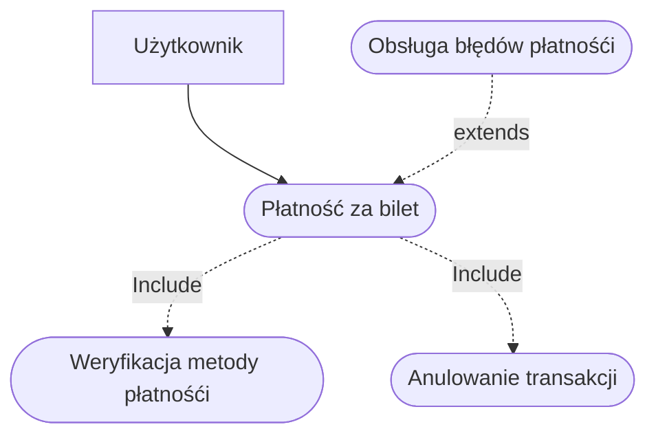

```mermaid
flowchart TD
    A[Użytkownik] -->B([Płatność za bilet])
    B -.-> |Include| C([Weryfikacja metody płatnośći])
    B -.-> |Include| D([Anulowanie transakcji])
    E([Obsługa błędów płatnośći]) -.-> |extends| B
```
