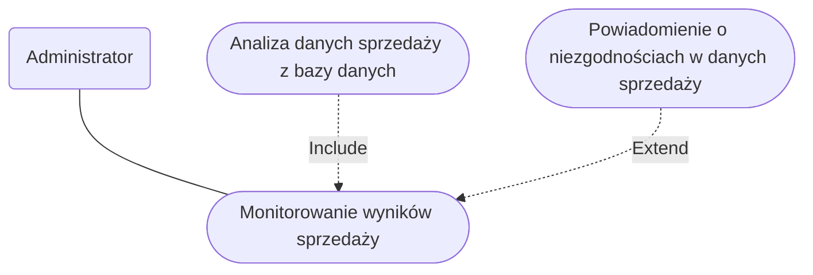
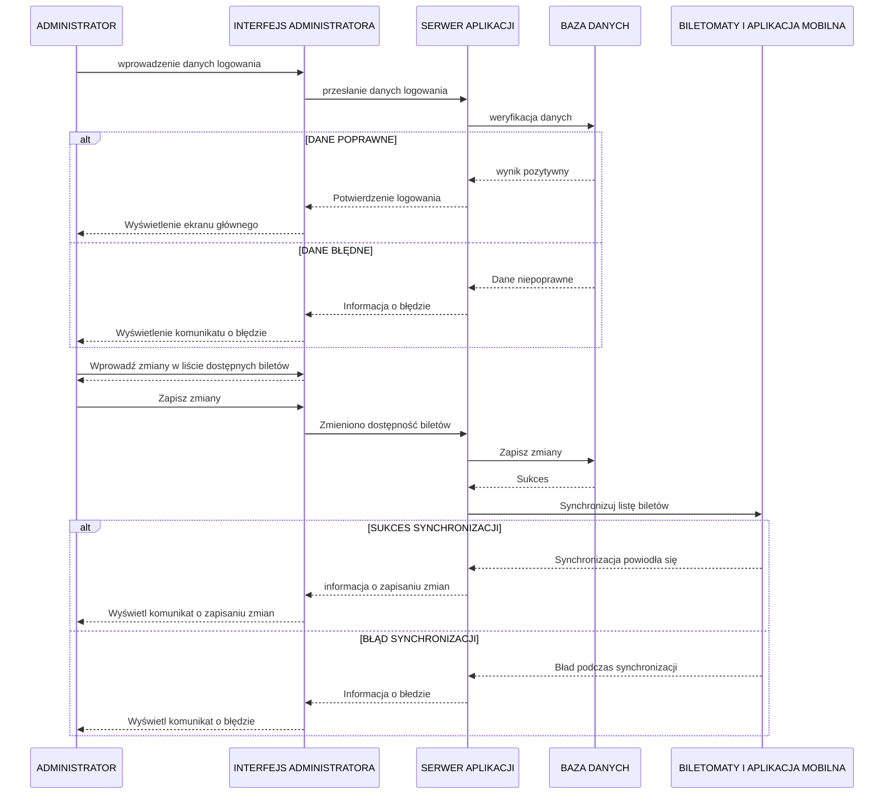

1. Jako administrator, chcę zdalnie aktualizować oprogramowanie biletomatów,
aby zapewnić zgodność z n
2. Jako administrator, chcę mieć dostęp do raportów sprzedaży w czasie 
rzeczywistym, aby monitorować wyniki finansowe. 
3. Jako administrator, chcę konfigurować dostępne bilety, promocje i taryfy w 
systemie centralnym, aby odzwierciedlać zmiany w ofercie. 

## DIAGRAMY PRZYPADKÓW UŻYCIA
### Zarządzanie dostępnością biletów

Opis krokowy:
1. Administrator loguje się do panelu zarządzania biletami (Logowanie do
systemu).
2. Administrator wprowadza zmiany w liście dostępnych biletów (np. dodaje nowe
bilety, usuwa nieaktualne) (Edytowanie listy biletów).
3. Administrator zapisuje zmiany w systemie centralnym (Zapisanie listy biletów).
4. System synchronizuje listę biletów z biletomatami i aplikacjami mobilnymi
(Synchronizacja listy biletów).

### Monitorowanie wyników sprzedaży

Opis krokowy:
1. Administrator loguje się do systemu raportowego (Logowanie do systemu
raportowego).
2. Administrator przegląda raporty sprzedaży w czasie rzeczywistym (Przegląd
raportów sprzedaży).
3. Administrator analizuje dane o sprzedaży na poziomie globalnym i lokalnym
(Analiza danych sprzedaży).
4. Administrator eksportuje raporty do dalszej analizy lub udostępnienia (Eksport
raportów).

## Wspólny diagram

## DIAGRAMY SEKWENCJI
### DIAGRAM SEKWENCJI DLA PRZYPADKU UŻYCIA ZARZĄDZANIE DOSTĘPNOŚCIĄ BILETÓW
- AKTOR: Administrator.
- OBIEKTY: Panelu zarządzania, Serwer aplikacji, Baza danych, Biletomaty i aplikacja.
- KOLEJNOŚĆ KOMUNIKATÓW:
    - Administrator loguje się do panelu zarządzania
    - Panel zarządzania przekazuje dane do serwera.
    - Serwer wysyła zapytanie do bazy danych.
    - Baza odpowiada.
    - Serwer zwraca wynik do panelu zarządzania.
    - Panel zarządzania informuje administratora o sukcesie lub błędzie.
    - Administrator wprowadza zmiany w liście dostępnych biletów.
    - Administrator klika przycisk "zapisz zmiany".
    - Panel zarządzania wysyła dane o zmianach do serwera
    - Serwer wysyła zapytanie do bazy danych o zapisanie zmian
    - Baza danych zwraca sukces albo błąd
    - Serwer wysyła informacje o zmianach do biletomatów i aplikacji
    - biletomaty i aplikacje aktualizują dane o biletach
- SCENARIUSZ ALTERNATYWNY 1 (błędne dane logowania):
    - Administrator loguje się do panelu zarządzania
    - Panel zarządzania przekazuje dane do serwera.
    - Serwer wysyła zapytanie do bazy danych.
    - Baza zwraca informacje o braku dopasowania.
    - Serwer zwraca informacje o błędzie do panelu zarządzania.
    - Panel zarządzania wyświetla komunikat o błędnych danych logowania.
- SCENARIUSZ ALTERNATYWNY 2 (Bład synchronizacji w produkcji)
    - Administrator klika przycisk "zapisz zmiany".
    - Panel zarządzania wysyła dane o zmianach do serwera
    - Serwer wysyła zapytanie do bazy danych o zapisanie zmian
    - Baza danych zwraca sukces albo błąd
    - Serwer wysyła informacje o zmianach do biletomatów i aplikacji
    - biletomaty i aplikacje napotykają bład przy synchronizacji biletów
    - biletomaty i aplikacje informuja serwer o problemie
    - serwer przesyła informacje o błedzie do panelu zarządzania
    - Panel zarządzania wyświetla komunikat o błedzie

    
