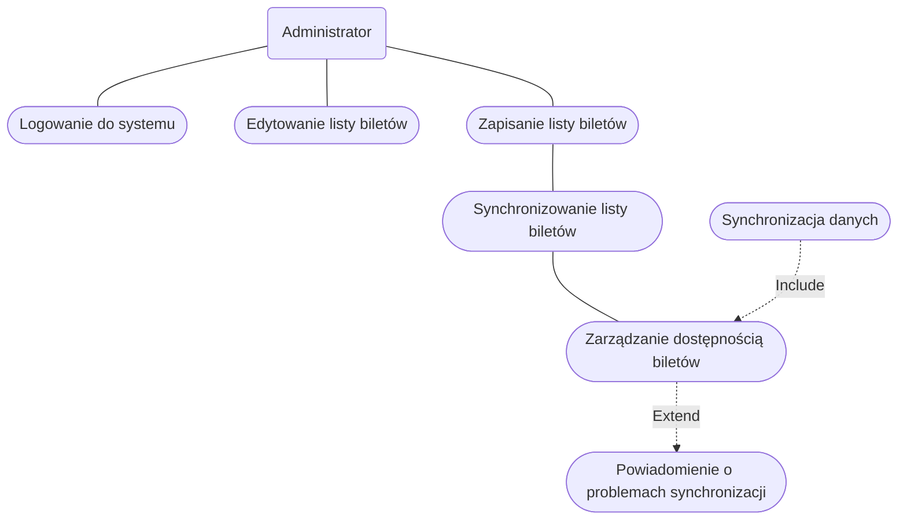

1. Jako administrator, chcę zdalnie aktualizować oprogramowanie biletomatów,
aby zapewnić zgodność z n
2. Jako administrator, chcę mieć dostęp do raportów sprzedaży w czasie 
rzeczywistym, aby monitorować wyniki finansowe. 
3. Jako administrator, chcę konfigurować dostępne bilety, promocje i taryfy w 
systemie centralnym, aby odzwierciedlać zmiany w ofercie. 

## DIAGRAMY PRZYPADKÓW UŻYCIA
### Zarządzanie dostępnością biletów

Opis krokowy:
1. Administrator loguje się do panelu zarządzania biletami (Logowanie do
systemu).
2. Administrator wprowadza zmiany w liście dostępnych biletów (np. dodaje nowe
bilety, usuwa nieaktualne) (Edytowanie listy biletów).
3. Administrator zapisuje zmiany w systemie centralnym (Zapisanie listy biletów).
4. System synchronizuje listę biletów z biletomatami i aplikacjami mobilnymi
(Synchronizacja listy biletów).

### Monitorowanie wyników sprzedaży

Opis krokowy:
1. Administrator loguje się do systemu raportowego (Logowanie do systemu
raportowego).
2. Administrator przegląda raporty sprzedaży w czasie rzeczywistym (Przegląd
raportów sprzedaży).
3. Administrator analizuje dane o sprzedaży na poziomie globalnym i lokalnym
(Analiza danych sprzedaży).
4. Administrator eksportuje raporty do dalszej analizy lub udostępnienia (Eksport
raportów).

## Wspólny diagram

## DIAGRAMY SEKWENCJI
### Monitorowanie wyników sprzedaży
- AKTOR: Administrator.
- OBIEKTY: SYSTEM RAPORTOWY, SERWER APLIKACJI
- KOLEJNOŚĆ KOMUNIKATÓW:
    - Administrator loguje się do systemu raportowego
    - System raportowy pobiera dostępne raport.
    - Serwer aplikacji zwraca listę dostępnych raportów.
    - Administrator analizuje dane o sprzedaży na poziomie globalnym i lokalnym 
    - Administrator eksportuje raporty do dalszej analizy 
    - System raportowy do eksportuje raporty serwera aplikacji
- SCENARIUSZ ALTERNATYWNY 1 (Brak dostępnych raportów ):
    - Serwer aplikacji zwraca błąd
    - System raportowy wyświetla komunikat błędu

