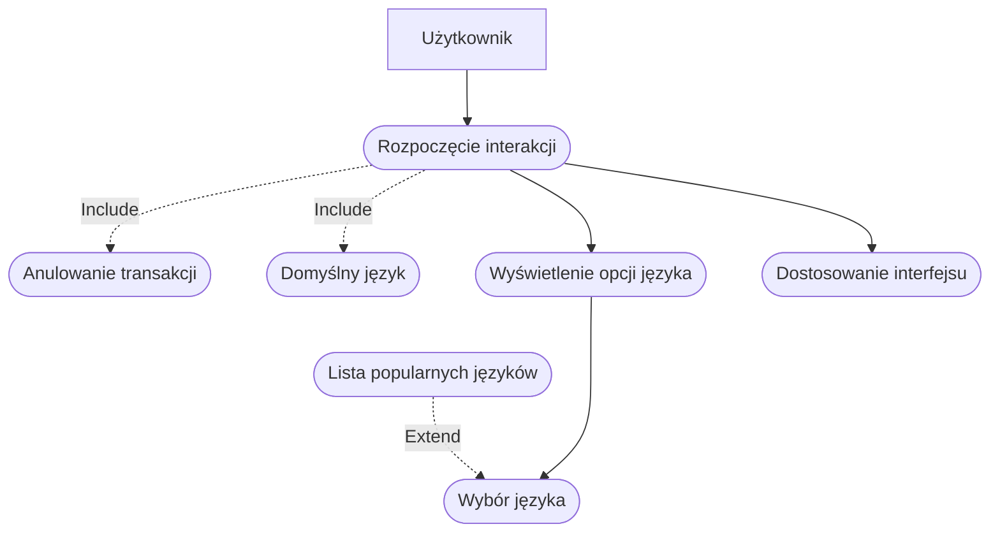
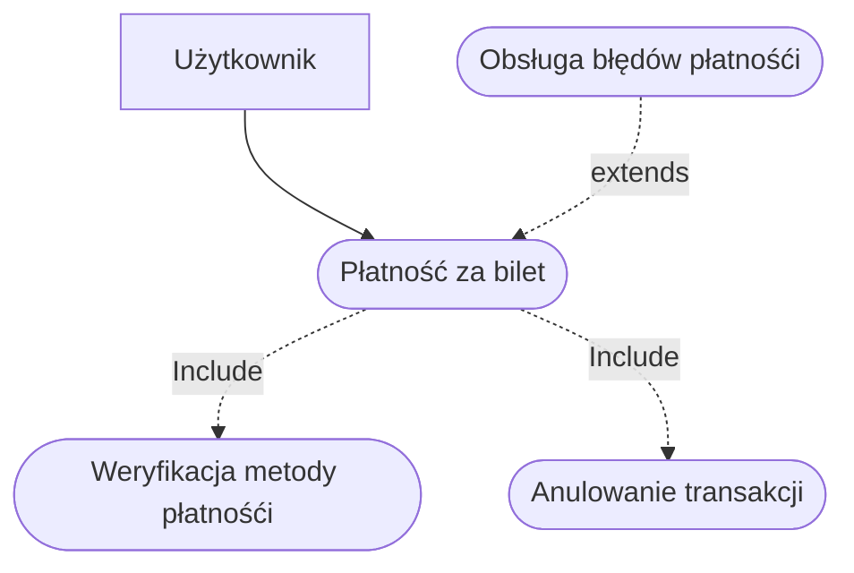
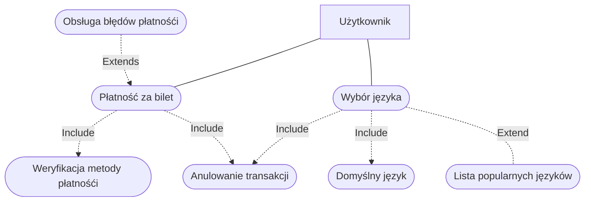

1. Jako użytkownik, chcę płacić za bilet kartą, gotówką lub telefonem, aby mieć
większą elastyczność w wyborze metody płatności.
2. Jako użytkownik, chcę otrzymać wyraźne instrukcje na ekranie, aby wiedzieć,
jak dokonać zakupu krok po kroku.
3. Jako użytkownik, chcę widzieć czas pozostały na decyzję (np. wyświetlany
licznik czasu), aby móc szybko podjąć działanie.
4. Jako użytkownik, chcę szybko wybrać rodzaj biletu, aby zminimalizować czas 
spędzony przy biletomacie. 
5. Jako użytkownik, chcę mieć możliwość wyboru języka, aby móc korzystać z 
biletomatu bez względu na znajomość języka lokalnego. 
6. Jako użytkownik, chcę sprawdzić poprawność transakcji przed jej finalizacją, 
aby uniknąć pomyłek. 
7. Jako użytkownik, chcę otrzymać potwierdzenie zakupu (np. wydruk biletu lub 
elektroniczny bilet), aby móc korzystać z transportu zgodnie z przepisami. 


## Diagram przypadków użycia
### 2. Wybór języka
Opis krokowy:
1. Użytkownik uruchamia biletomat (Rozpoczęcie interakcji).
2. System wyświetla ekran powitalny z opcjami wyboru języka (Wyświetlenie opcji 
języka).
3. Użytkownik wybiera preferowany język (Wybór języka).
4. System dostosowuje interfejs do wybranego języka (Dostosowanie interfejsu).
5. Użytkownik w dowolnym momencie może anulować proces (Anulowanie 
transakcji).
Relacje:
• Include: Ustawienie domyślnego języka (Domyślny język).
• Include: Anulowanie transakcji (Anulowanie transakcji).
• Extend: Wyświetlenie listy popularnych języków (opcjonalne) (Lista 
popularnych języków)



### Płatność za bilet
Opis krokowy:
1. Użytkownik wybiera metodę płatności (karta, gotówka, telefon) (Wybór metody
płatności).
2. System weryfikuje dostępność wybranej metody (Weryfikacja metody
płatności).
3. Użytkownik dokonuje płatności (np. wprowadza kartę, gotówkę, korzysta z NFC)
(Realizacja płatności).
4. System potwierdza zakończenie transakcji (Potwierdzenie transakcji).
5. Użytkownik w dowolnym momencie może anulować proces (Anulowanie
transakcji).




### Wspólny diagram


## DIAGRAMY SEKWENCJI
### DIAGRAM SEKWENCJI DLA PRZYPADKU UŻYCIA ZMIANY JĘZYKA
- AKTOR: Użytkownik.
- OBIEKTY: Interfejs użytkownika, Serwer aplikacji, Baza danych.
- KOLEJNOŚĆ KOMUNIKATÓW:
    - Użytkownik uruchamia okno zmiany języka
    - Interfejs przekazuje informacje do serwera
    - Serwer wysyła zapytanie o dostępne języki do bazy danych.
    - Baza danych zwraca listę dostępnych języków.
    - Serwer wysyła informacje o dostępnych językach do interfejsu użytkownika
    - Interfejs użytkownika wyświetla listę dostępnych języków
    - Użytkownik wybiera jeden z dostępnych języków
    - Interfejs użytkownika ustawia wybrany język
- SCENARIUSZ ALTERNATYWNY 1 (Użytkownik anulował zmianę języka):
    - Użytkonik wybiera opcję anuluj.
    - Interfejs użytkownika zamyka okno zmiany języka.
    - Interfejs użytkownika wraca do okna głównego

 ```mermaid
sequenceDiagram
PARTICIPANT USER AS UŻYTKOWNIK
PARTICIPANT UI AS INTERFEJS UŻYTKOWNIKA
PARTICIPANT SERWER AS SERWER APLIKACJI
PARTICIPANT DB AS BAZA DANYCH


    USER->>UI: Pokaż okno zmiany języków
    UI ->> SERWER: Wybrano okno zmiany języka
    SERWER ->> DB: Pobierz listę języków
    DB -->> SERWER: Lista języków
    SERWER -->> UI: Przekaż listę języków
    UI -->> USER: Wyświetl dostępne języki
    ALT Zmieniono język
        USER ->> UI: Wybierz jeden z języków
        UI ->> UI: Zmień język interfejsu
        UI -->> USER: 
    ELSE Anulowano
        USER ->> UI: Anuluj zmianę języka
        UI ->> UI: Zamknij okno zmiany języka
        UI -->> USER: Wróc do okna głównego
    END

 
```
